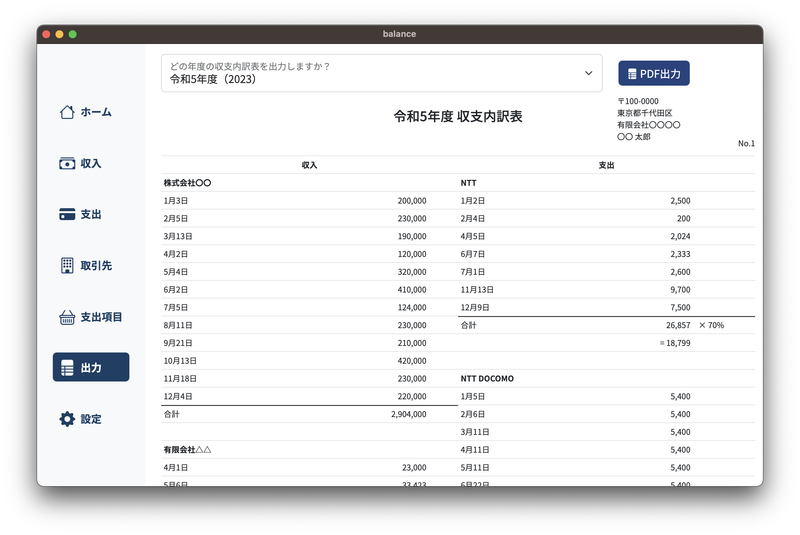
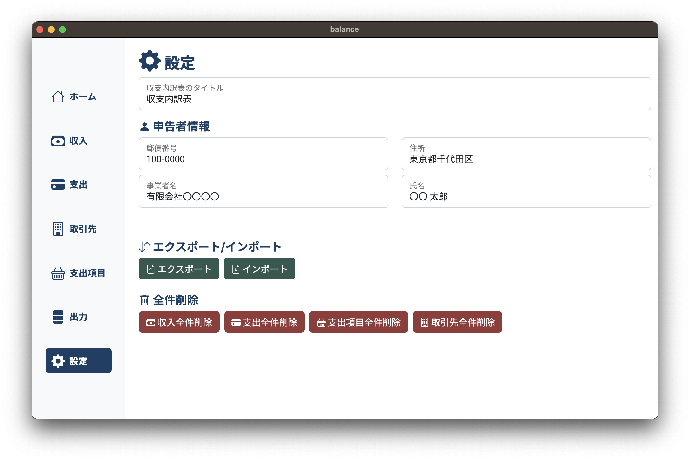

# Balance


## 概要
収支内訳表を作成するアプリです。

## 環境
* Node.js
* Electron
* Vue.js
* NeDB

## セットアップ
```
npm install
```

### コンパイル
```
npm run electron:serve
```
### デプロイ
```
npm run electron:build
```

## 使い方
下記情報を登録し、収支内訳表をPDFで出力します。

### 取引先
収入として計上する取引先の名前を登録します。  
取引先一覧の左側をドラッグすると、取引先を並び替えることができます。  
PDF出力時に、取引先一覧の並び順で出力されます。  
**公的年金** のトグルスイッチで、[PDF出力](#pdf出力)時に営業所得として計上するか、公的年金として計上するかを設定します。


### 収入
[取引先](#取引先)から、いつ、いくらの収入があったかを登録します。  
登録した収入情報を、取引先／年別に絞り込むことができます。


### 支出項目
支出として計上する項目の名前と、経費とする割合を登録します。  
支出項目一覧の左側をドラッグすると、支出項目を並び替えることができます。  
PDF出力時に、支出項目一覧の並び順で出力されます。  


### 支出
[支出項目](#支出項目)ごとに、いつ、いくらの支出があったかを登録します。  
備考として、名目を記載することができます。  
登録した支出情報を、支出項目／年別に絞り込むことができます。


### FOCUSモード
収入／支出画面の上部にある「FOCUS」ボタンから、日付と金額を一括入力して登録できるFOCUSモードが利用できます。  
ヘッダ部で登録したい[取引先](#取引先)／[支出項目](#支出項目)と年を入力し、明細欄に日付、金額（支出の場合は備考）を入力し、登録ボタンを押下します。  
明細部の行数や、登録する[取引先](#取引先)／[支出項目](#支出項目)の数を変更することもできます。


### PDF出力
PDF出力時のプレビューを表示し、出力します。  
上部のコンボボックスから出力する年を選択し、プレビューを表示します。  
右側のPDF出力ボタンからファイルを出力できます。  
ヘッダ部の情報（タイトルや住所など）は、[設定](#設定)画面から入力できます。


### 設定
PDF出力時のタイトル、申告者情報を入力します。  
登録したデータのインポート／エクスポートができます。  
（JSON形式で出力されます）  
データの全件削除が利用できます。  
（挙動がおかしくなった際にお試しください）  


## 免責
このソフトウェアの使用で生じたいかなる損害も、作者は責任を負いません。  
ご使用の際はご自身の責任でお願いいたします。
